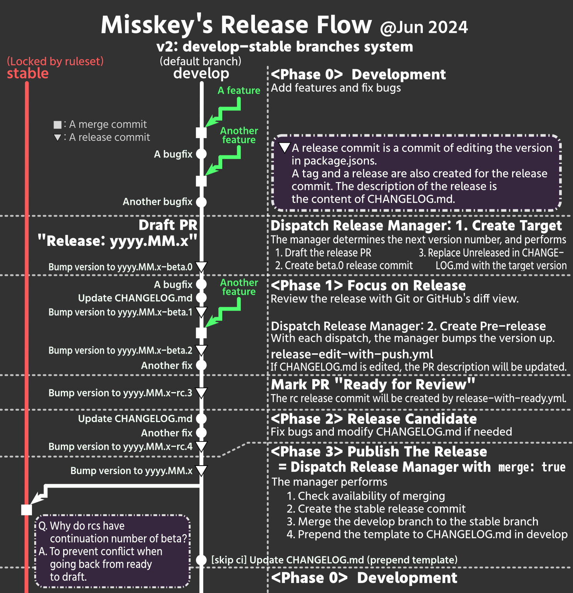

# Release Manager
GitHub Actions workflows for release management of the repository. 

## Flow

## Installation
### 1. Variable(s) to set
- Make the stable branch and set the name to `STABLE_BRANCH`
- If you want to rewrite package.json(s), set `PACKAGE_JSONS_TO_REWRITE` and `INDENT` according to [the Variables clause](#variables).

### 2. workflows you should copy
Copy and use these workflows.

#### ⅰ. release-with-dispatch.yml (Release Manager [Dispatch])
The core workflow that is manually triggered. It has three functions:

1. Prepare release - create PR and beta.0 tag
2. Issue a pre-release version during the release process
3. Issue a stable release and merge PR, when you check `MERGE RELEASE BRANCH TO MAIN`

#### ⅱ. release-edit-with-push.yml
This workflow changes the description of the PR when CHANGELOG.md is changed.

You must modify line#6 with the default (develop) branch.

#### ⅲ. release-with-ready.yml
Release rc when PR becomes ready for review.

### 3. Create a GitHub App
You must create a GitHub App with following settings and set `RELEASE_APP_ID` and `RELEASE_APP_PRIVATE_KEY` as secrets.

Please execute following installation: https://github.com/actions/create-github-app-token/tree/v1/?tab=readme-ov-file#usage

- The `Contents` permission is required for the `on: release` workflow to run via automatic release.  
  The reason is that `on: release` workflows are not triggered for releases created with the default `GITHUB_TOKEN`.
- The `Pull requests` permission is required to bypass the protect on the stable branch and perform PR merges.

|App Settings||
|:--|:--|
|Webhook||
|Active|disabled|
|Repository permission||
|Contents|Read and Write|
|Pull requests|Read and Write|

Open `Install App` tab and install to the repository or whole the user/organization.

Then set `USE_RELEASE_APP` as `true` [as a repository variable](https://docs.github.com/en/actions/learn-github-actions/variables#creating-configuration-variables-for-a-repository).

### 4. Create a ruleset to protect the stable branch
To maintain the integrity of the stable branch, it is recommended that it prohibit push by ruleset.

|New Branch Ruleset||
|:--|:--|
|Enforcement status|Active|
|Bypass list||
|+ Add bypass|GitHub App you created and installed|
|Targets|
|Target branches|stable|
|Branch protections||
|Restrict creations|Enable|
|Restrict updates|Enable|
|Restrict deletions|Enable|
|Require a pull request before merging|Enable|
|Required approvals|1|
|Block force pushes|Enable|

## Repository secrets and variables
### Secrets
<dl>
<dt><code>RELEASE_APP_ID</code> <i>(optional)</i></dt>
<dd>See "If you have `on: release` workflows..."</dd>
<dt><code>RELEASE_APP_PRIVATE_KEY</code> <i>(optional)</i></dt>
<dd>PEM cert. See "If you have `on: release` workflows..."</dd>
</dl>

### Variables

<dl>
<dt><code>STABLE_BRANCH</code></dt>
<dd>Name of the stable branch targeted by the release PR. **Required.**</dd>
<dt><code>PACKAGE_JSONS_TO_REWRITE</code> <i>(optional)</i></dt>
<dd>package.jsons to rewrite version e.g. <code>"package.json" "packages/misskey-js/package.json"</code></dd>
<dt><code>INDENT</code> <i>(required when PACKAGE_JSONS_TO_REWRITE be set)</i></dt>
<dd>Indent type of package.json. <code>tab</code> or number of spaces</dd>
<dt><code>USE_RELEASE_APP</code></dt>
<dd>See "If you have `on: release` workflows..."</dd>
</dl>
